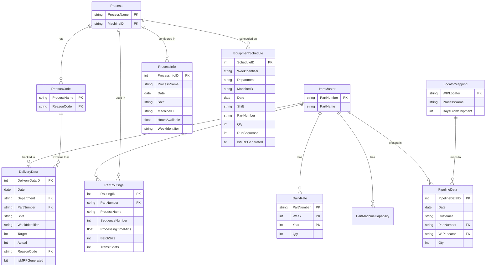

# Production Manager

**Production Manager** is a comprehensive manufacturing planning and intelligence tool designed to streamline production scheduling, capacity management, and delivery tracking. Built for modern manufacturing environments, it provides an intuitive interface for managing complex equipment schedules, analyzing production losses, and maintaining a robust planning pipeline.

---

## 🌟 Key Features

### 1. Delivery Dashboard & Scorecard
* **Performance Tracking:** Monitor daily attainments versus targets across multiple departments and processes in real-time.
* **Loss Pareto Analysis:** Visualize and analyze primary drivers of production losses (e.g., machine downtime, material shortages, labor) to drive continuous improvement.
* **Role-Based Access:** Simplified read-only displays for supervisors and full CRUD management capabilities for authorized planners.

### 2. Interactive Equipment Scheduler
* **Drag-and-Drop Scheduling:** Effortlessly assign production orders from a centralized backlog directly to machine shifts using a fluid, responsive interface.
* **Real-Time Capacity Management:** Visual indicators for machine load, available capacity, and utilization percentages per shift.
* **Intelligent Auto-Scheduling:** An advanced engine that automatically processes unassigned backlog items based on part-machine capabilities, standard processing times, and available shift capacities.
* **Job Splitting & Re-balancing:** Automatically handles job splits when shift capacity is exceeded, ensuring plans remain realistic and achievable.

### 3. Equipment & Process Management
* **Machine Capability Mapping:** Define granular part-machine compatibility with specific processing rates and efficiencies.
* **Routing Constraints:** Manage manufacturing routings and process-specific constraints to ensure valid schedules.
* **Shift Configuration:** Define standard shift hours and availability for precise capacity planning across different production lines.

### 4. Production Planning
* **Target Management:** Set and adjust daily production targets based on customer demand and internal capacity.
* **Attainment Analysis:** Compare actual production output against original plans with visual "Shortfall" and "Early" indicators to identify scheduling deviations.
* **Backlog Management:** Maintain a prioritized list of production requirements ready for scheduling.

### 5. Robust Data Management
* **Centralized Master Data:** Single source of truth for Part Information, Machine Capabilities, and Reason Codes managed via a dedicated settings interface.
* **SQL Server Native:** Direct, secure connection to an MSSQL backend for reliable data persistence across the organization.
* **Flexible Data Imports:** Support for parsing, transposing, and importing raw planning data and CSVs directly into the backend.

---

## 🛠️ Technology Stack

This application is built using a modern desktop stack, bridging a highly responsive frontend with a performant systems-level backend. 

* **Frontend Framework:** React 19, Next.js 15 (App Router), TypeScript
* **UI & Styling:** Mantine v8, Tailwind CSS, Lucide React (Icons)
* **Interaction:** `@hello-pangea/dnd` for complex drag-and-drop state management
* **Desktop Runtime:** Tauri v2
* **Backend (Tauri Core):** Rust (v1.77.2+)
* **Database Driver:** `tiberius` (Async SQL Server driver for Rust)
* **State Management:** Zustand, Jotai

---

## 📊 Database Schema

Production Manager utilizes an MSSQL database for all persistent data. The schema is designed for SARGability and efficient index utilization to support real-time scheduling and analytics.

### Diagram



### Table Initialization

To set up the required tables in your SQL Server instance:

1. **Core Schema**: Execute the [database_schema.sql](file:///c:/Users/joeya/OneDrive/Desktop/production-forecaster-main/production-forecaster-main/database_schema.sql) script to establish the primary Item Master and Part Routing structures.
2. **Dashboard & Scheduler Tables**: Execute the [schema_updates.sql](file:///c:/Users/joeya/OneDrive/Desktop/production-forecaster-main/production-forecaster-main/schema_updates.sql) script to create the necessary tables for delivery tracking, capacity management, and scheduling.

> [!NOTE]
> Ensure you have an active MSSQL database and the necessary permissions to create tables and indexes.

---

## 🚀 Getting Started

Follow these instructions to run the application locally in development mode.

### Prerequisites

* [Node.js](https://nodejs.org/) (v18 or higher recommended)
* [Rust](https://www.rust-lang.org/tools/install) (v1.77.2 or higher)
* MSSQL Database instance (for full master data and scheduling functionality)

### Installation & Setup

1. **Clone the repository**
   ```bash
   git clone <repository-url>
   cd production-manager
   ```

2. **Install frontend dependencies**
   ```bash
   npm install
   ```

3. **Configure Environment Variables**
   Create a `.env.local` file in the root directory and add any required API keys:
   ```env
   GEMINI_API_KEY=your_api_key_here
   ```

4. **Database Configuration**
   The application requires a connection string to an MSSQL database. You will input and save this connection string within the application's "Database Settings" tab upon first launch.

### Running the App

To launch the application in development mode (spawns both the Next.js dev server and the native Tauri window):

```bash
npm run tauri dev
```

*(Note: Running standard `npm run dev` will only start the web server; you must use the Tauri CLI command above to access the native file system, dialogs, and Rust backend commands.)*

---

## 📂 Project Structure

* **`/app`**: Next.js App Router definitions, global layouts, and main entry points.
* **`/components`**: Reusable React components organized by domain (Scheduler, Management, Scorecard).
* **`/lib`**: Core utilities, global state stores (Zustand), and shared TypeScript interfaces.
* **`/src-tauri`**: The Rust backend core handling database connectivity and heavy logic.
  * **`src/commands/`**: Modularized command handlers for scheduling, master data, and analytics.
* **`database_schema.sql`**: SQL definitions for the required database tables and relationships.

---

## 🔒 Roles & Access

The application operates using a dual-role access model to protect sensitive planning data while remaining accessible to shop-floor personnel.

* **Supervisor Mode:** Focused on daily execution. Supervisors can view delivery scorecards, monitor production status, and submit attainment data.
* **Planner Mode:** Unlocks advanced planning capabilities including:
  * Drag-and-drop equipment scheduling and auto-schedule execution.
  * Production plan and target management.
  * Master data management (Reason Codes, Part-Machine Capabilities, Routing).
  * System-wide configuration and data imports.

---

## 📝 License

Pending

